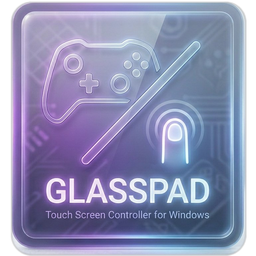
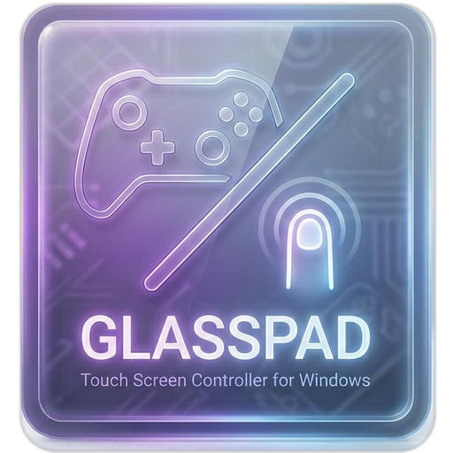

<div align="center">



# GlassPad

**Touchscreen → Gamepad Overlay for Windows**

Turn your touchscreen into a virtual Xbox controller — no hardware required.  
Designed for the **ASUS ROG Flow Z13** and other touch-screen Windows laptops.

[](LICENSE)
[](https://www.microsoft.com/windows)
[](https://dotnet.microsoft.com/)
[](https://ko-fi.com/dansunmi)

</div>

---

<div align="center">

</div>

---

## Features

- **Fully transparent overlay** — touches pass through to the game where no buttons exist
- **Virtual Xbox One controller** via HIDMaestro (UMDF2 kernel driver)
- Analog sticks, triggers, bumpers, face buttons, **L3 / R3**, D-pad (4-way / 8-way), guide button
- **D-pad visual feedback** — cyan arm highlights on press; 8-way mode shows a surrounding ring
- **Edit mode** — drag and resize any button, adjust opacity, save layout
- Layout persists across sessions (`%AppData%\GlassPad\layout.json`)
- Driver installs **once** on first launch — subsequent launches start instantly
- Minimal UI — FAB-style control hub, no window chrome

---

## Requirements

| | |
|---|---|
| OS | Windows 11 (22H2 or later recommended) |
| Architecture | x64 |
| .NET | [.NET 10 Desktop Runtime](https://dotnet.microsoft.com/download/dotnet/10.0) |
| Driver | HIDMaestro UMDF2 — installed automatically on first launch |
| Hardware | Any Windows touch-screen device (optimized for ROG Flow Z13) |

> **First launch requires Administrator** so HIDMaestro can install its kernel driver.  
> After that, normal (non-admin) launches work fine.

---

## Build from Source

```bash
git clone https://github.com/dansunmi/GlassPad.git
cd GlassPad
dotnet build src/GlassPad/GlassPad.csproj -c Release
```

Requires **.NET 10 SDK**. The build references `lib/HIDMaestro/HIDMaestro.Core.dll` (included, MIT licensed).

---

## Usage

1. Launch `GlassPad.exe` **(as Administrator on first run)**
2. The overlay appears full-screen and transparent — start your game
3. Tap **≡** at the top-center to open the control hub:

| Button | Action |
|--------|--------|
| **✕** | Quit GlassPad |
| **✎** | Edit layout — drag, resize, opacity slider, save |
| **ℹ** | About |
| **⊘** (hold) | Temporarily disable overlay |

---

## Project Structure

```
src/
  GlassPad/          Main WPF overlay application
    Input/           DpadZone, StickZone, PadService (HIDMaestro wrapper)
    Overlay/         GamepadLayout, LayoutEditor, Win32Helper
    img/             App icon assets
lib/
  HIDMaestro/        HIDMaestro.Core.dll + LICENSE
```

---

## Known Limitations

- **Exclusive fullscreen is not supported.** Use **Windowed** or **Borderless Windowed** mode in your game settings. In exclusive fullscreen, the game takes over the entire display and the overlay cannot render on top of it.

- **Simultaneous button presses may not register correctly.** Due to a WPF touch-routing limitation, two buttons pressed at the exact same instant can sometimes be missed. This is a known issue currently under investigation. **Workaround:** press the second button ~0.1 seconds after the first — inputs staggered slightly this way work reliably.

---

## Changelog

### v1.0.1
- Added **L3 / R3** buttons (left/right stick click) next to LB/RB

### v1.0.0
- Initial release

---

## Credits

- **[HIDMaestro SDK v1.3.15](https://github.com/hifihedgehog/HIDMaestro)** — virtual controller driver (MIT License)
- Built with C# / .NET 10 / WPF

---

## Support

If GlassPad is useful to you, consider buying me a coffee!

[](https://ko-fi.com/dansunmi)

Blog: [blog.rpm.moe](https://blog.rpm.moe/)

---

## License

MIT — see [LICENSE](LICENSE)
